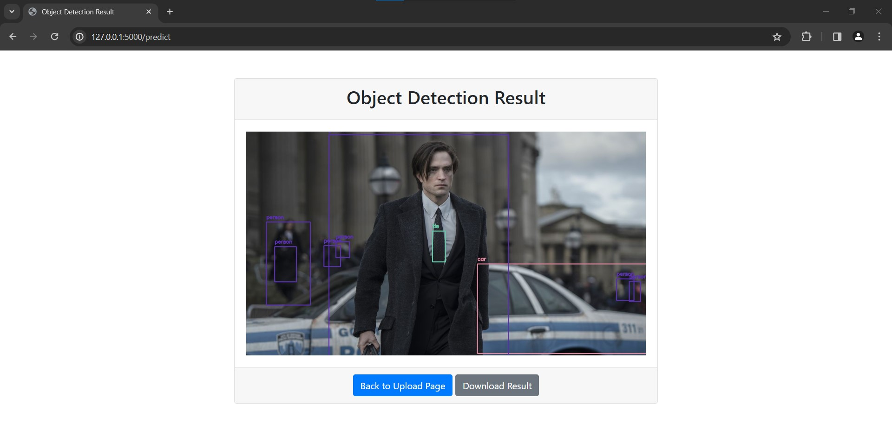

# Object Detection Web App using YOLOv3

This project deploys a computer vision model trained to detect common objects in images using [YOLOv3](https://pjreddie.com/darknet/yolo/) (You Only Look Once version 3), a state-of-the-art, real-time object detection system. The model is served as a web application using [Flask](https://flask.palletsprojects.com/en/3.0.x/), a lightweight web server gateway interface (WSGI) web application framework. For production, the web application can be served using [Waitress](https://flask.palletsprojects.com/en/3.0.x/deploying/waitress/), a production-quality pure-Python WSGI server with very acceptable performance.

## Features

- Upload an image and detect objects in the image using YOLOv3.
- View the processed image with bounding boxes and labels for detected objects.
- Download the processed image for offline use.

## Example

The image below demonstrates the object detection capabilities of the model. The model was able to accurately identify and locate the objects in the scene from the movie "The Batman (2022)".



## Usage

1. Clone the repository.
2. Install the required dependencies using the following command:
   ```bash
   pip install -r requirements.txt
   ```
3. Run the Flask server (development) using the following command:
   ```bash
   python server.py
   ```
   If you want to run the server in production, you can use the following command:
   ```bash
   waitress-serve --host 127.0.0.1 server:app
   ```
4. Open the web application in your browser.
5. Upload an image and click 'Submit' to process the image.
6. View the processed image with detected objects.
7. Download the processed image if desired.

## Acknowledgements

- [Using Tailwind with Flask](https://www.codewithharry.com/blogpost/using-tailwind-with-flask/) by CodeWithHarry: This guide was used to set up and use Tailwind CSS in this Flask project.
